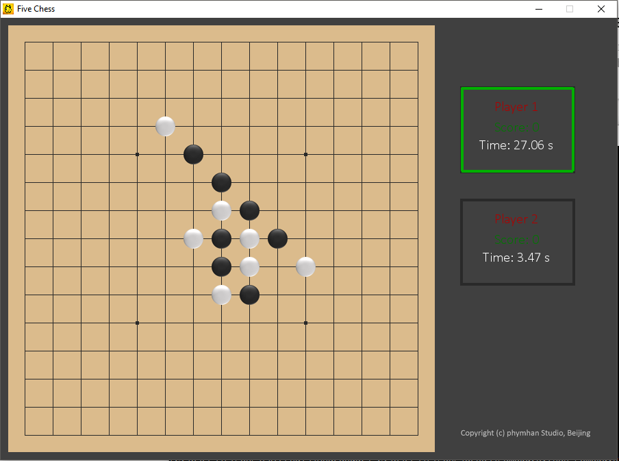

# A simple [Gomoku](https://en.wikipedia.org/wiki/Gomoku) game written in Python
- GUI and CLI interface
- A simple implementation of AI player
- Play remotely through socket interface


## How to use
Simply run
```
python gomoku.py
```
or a CLI version (pretty much forked from [Skywind](https://github.com/skywind3000/gobang))
```
python gomoku_cli.py
```
Enjoy!

## Game control and settings
Change player types in `gomoku.py`:
```python
PLTYP1 = 'human'
PLTYP2 = 'computer'
```
Music and sound effect:
```python
play_music = True
play_sound = True
```

## Acknowledgement
AI code adopted from [here](https://github.com/skywind3000/gobang) by [Skywind](http://www.skywind.me/blog/).
